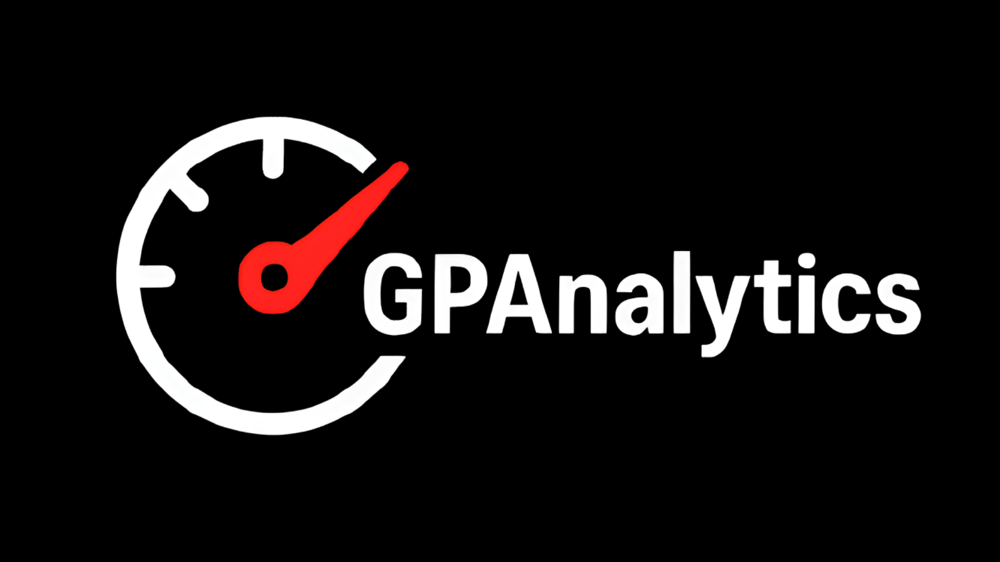

# GPAnalytics



**GPAnalytics** is a project that provides race lap times and pace analysis for each driver in a specific race. It is designed to offer a clear and accessible way to view race performance data.

> **Note:** Currently, the application supports all categories (MotoGP, Moto2, Moto3, etc.) for a given race, but it exclusively processes **Analysis** PDF documents.

---

## 🚀 Features

- **PDF Data Extraction:** Automatically downloads and parses official MotoGP "Analysis" PDFs to extract accurate lap-by-lap times for every rider using `pypdf`.
- **Interactive Pace Calculation:** Click on specific laps to dynamically include or exclude them from the average race pace. Includes a quick toggle to exclude Lap 1 for all riders.
- **Visual Analytics:** Generates interactive line charts for each rider using `Chart.js` to easily spot pace trends, drop-offs, and consistency.
- **Rich Rider Profiles:** Integrates with the official MotoGP API (PulseLive) to fetch entry lists, rider portraits, team colors, and background textures for a premium UI experience.
- **Smart Caching & Resilience:** Implements connection pooling, HTTP retries with backoff, and LRU caching to minimize external API calls and handle network instability gracefully.
- **Fully Responsive UI:** Built with HTML5, CSS3, and Vanilla JavaScript for a fast, client-side interactive experience without needing complex frontend frameworks.

---

## 🛠️ Tech Stack

**Backend:**
- Python 3
- Flask (Web Framework)
- Requests & urllib3 (API fetching & connection pooling)
- pypdf (PDF parsing & text extraction)

**Frontend:**
- HTML5 / CSS3 (Custom styling, CSS Variables, Flexbox/Grid)
- Vanilla JavaScript (Dynamic form loading, DOM manipulation)
- Chart.js (Data visualization)

---

## ⚙️ Installation & Setup

1. **Clone the repository:**
   ```bash
   git clone https://github.com/yourusername/GPAnalytics.git
   cd GPAnalytics
   ```

2. **Create and activate a virtual environment:**
   ```bash
   python -m venv venv
   source venv/bin/activate  # On Windows use: venv\Scripts\activate
   ```

3. **Install dependencies:** Make sure your `requirements.txt` includes `Flask`, `requests`, and `pypdf`.
   ```bash
   pip install -r requirements.txt
   ```

4. **Run the application:**
   ```bash
   python app.py
   ```

5. **Access the app:** Open your web browser and navigate to `http://127.0.0.1:5000`.

---

## 📖 Usage

1. **Select the Event:** On the homepage, follow the pipeline to sequentially select the Championship Year, Circuit, Category, and Official Session.
2. **Select the Document:** Choose the "Analysis" document (PDF) from the dropdown. The "Open" button will become active.
3. **Analyze Pace:**
   - Click "Open" to process the PDF and load the interactive grid.
   - Click on individual lap times to toggle their inclusion in the race pace calculation.
   - Use the "Exclude lap 1 for all riders" button for a quick baseline pace.
   - Click "Show chart" under any rider to view their lap time progression graph.

---

## 📝 To-do list

- [ ] Free practices support
- [ ] Head-to-head support
- [ ] No-portraits handling
- [ ] Add track images in results
- [ ] Slow loading fix